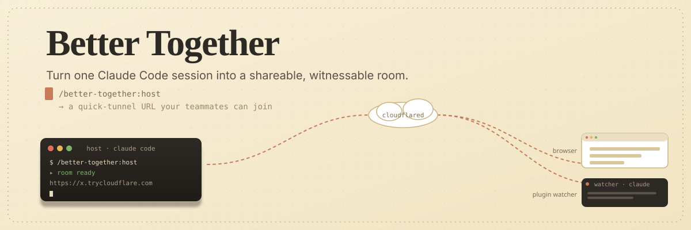
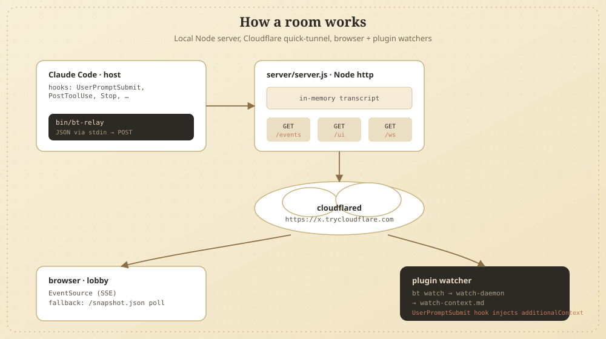

<p align="center">
  
</p>

<h1 align="center">Better Together</h1>

<p align="center">
  <em>A Claude Code plugin that turns one developer's session into a shareable, witnessable room.</em>
</p>

<p align="center">
  <a href="./PRD.md">Product spec</a> ·
  <a href="#usage">Usage</a> ·
  <a href="#architecture">Architecture</a> ·
  <a href="#limitations-v1">Limitations</a>
</p>

---

The host drives; teammates join by URL — either in a browser or in their own Claude Code with a private analyst Claude alongside the host's stream.

Hosting is ephemeral and zero-config: a Cloudflare quick-tunnel exposes the host's local server on a randomly assigned `*.trycloudflare.com` URL. No accounts, no infra, no central service. The product targets small trusted groups doing pairing, mentoring, code review, or async "show me what you tried" workflows.

## Prerequisites

- Claude Code 2.1.105 or later (uses plugin features)
- Node.js 18+ (for the local server; uses only built-ins, no `npm install` required)
- macOS with Homebrew (for the auto-install of `cloudflared`), or `cloudflared` already on PATH

The first time you run `/better-together:host`, the plugin auto-installs `cloudflared` via Homebrew if it isn't already present. On Linux without `cloudflared`, the room runs in local-only mode and you'll see manual install instructions in the terminal.

## Install (development)

While iterating, run Claude Code with the plugin loaded directly from this checkout:

```
claude --plugin-dir /path/to/better-together
```

Slash commands appear under the `/better-together:*` namespace. Run `/help` to see them.

To install permanently (later, once published to a marketplace), see the Claude Code [plugin docs](https://code.claude.com/docs/en/discover-plugins).

## Usage

### Host a room

```
/better-together:host
```

The first time you run this, the plugin shows a one-time disclosure about what watchers will see. Re-run with `--accept` to confirm and start hosting:

```
/better-together:host --accept
```

The plugin spawns a local server, opens a Cloudflare quick-tunnel, prints the room URL, and copies it to your clipboard. Share the URL with anyone you want in the room.

### Join in a browser

Anyone with the room URL can open it in a browser. They'll be prompted for a display name on first visit and dropped into the live lobby.

### Join from your own Claude Code

```
/better-together:watch <url>
```

This connects you to the host's room as a "plugin watcher." Your local Claude sees the host's transcript as live context — every prompt you submit gets the latest few thousand chars of the host's session injected as a system-reminder. Ask your Claude things like "what's the host trying to do?" without disturbing the host.

### Comment

Anchored to the latest host turn:
```
/better-together:comment your message here
```

Anchored to a specific turn id (visible in the lobby UI):
```
/better-together:comment-on t14 your message here
```

The host sees comments as a side-channel notification. Comments are *not* injected into the host's Claude — they read them out-of-band and decide whether to act on them.

### Status & teardown

```
/better-together:pulse        # show whether you're hosting / watching / idle
/better-together:who          # list watchers (host only)
/better-together:comments     # show pending comments
/better-together:kick <name>  # disconnect a watcher
/better-together:end          # close the room
/better-together:unwatch      # disconnect from a room you're watching
```

When you exit Claude Code, the room is automatically torn down via the `SessionEnd` hook.

## Privacy

The host's session contains everything in their local context — code, file paths, error messages, half-formed thoughts. Sharing a room shares all of that. The disclosure on first `/better-together:host` is mandatory; treat the room URL like a Zoom link.

A redaction filter for outbound transcript events is planned for v1.5; until then, be deliberate about what's on screen when you host.

## Architecture

<p align="center">
  
</p>

State lives at `${CLAUDE_PLUGIN_DATA}/state.json` (resolves to `~/.claude/plugins/data/better-together-*/`). The detached server and tunnel processes survive plugin updates and Claude Code restarts; `SessionEnd` hook does best-effort teardown.

No `npm install` step — the server uses only Node built-ins (`http`, `https`, `fs`, `path`, `child_process`). The browser uses native `EventSource` for SSE.

## Limitations (v1)

- Single host per room. The role doesn't transfer.
- Rooms end when the host closes Claude Code or runs `/better-together:end`. No persistence, no replay archive.
- Watch-mode context injection is capped at the host's most recent ~9.5K characters of transcript (the Claude Code `additionalContext` limit is 10K).
- Cloudflare quick-tunnel URLs are not stable — if the tunnel reconnects, the URL may change and watchers will be stranded.
- No auth beyond "you have the URL." Optional `--secret` join tokens are planned for v1.5.
- **Cloudflare quick-tunnels buffer SSE responses.** The lobby's preferred transport is SSE (instant updates); when watchers connect via `*.trycloudflare.com`, Cloudflare's edge buffers the stream. The lobby auto-detects this within 3 seconds and falls back to polling `/snapshot.json` every 2.5 seconds. Watchers on the host's LAN (connecting directly to `http://<host-ip>:PORT`) get true SSE with no polling.

## License

MIT
